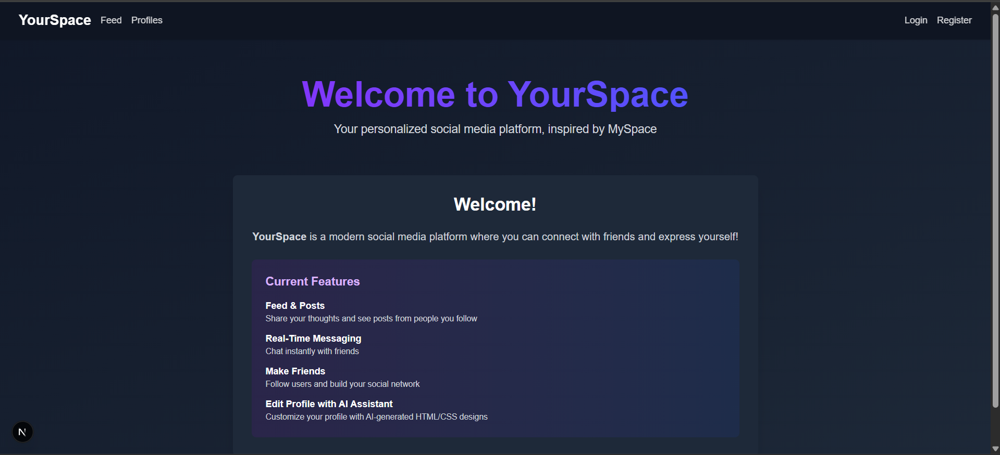
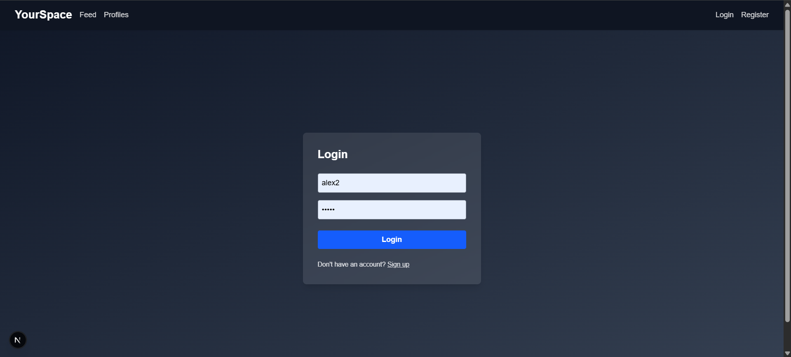
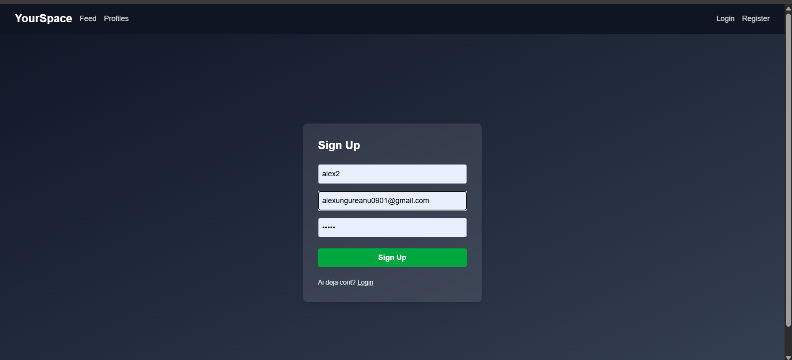
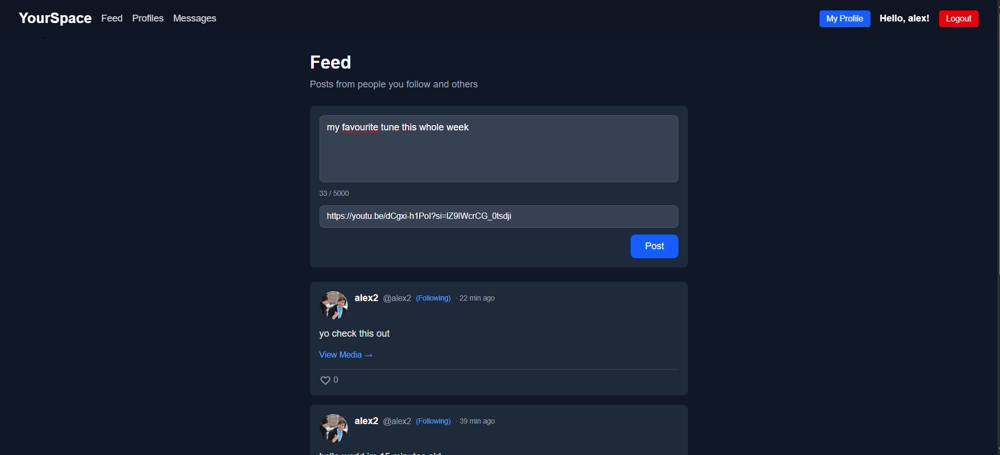
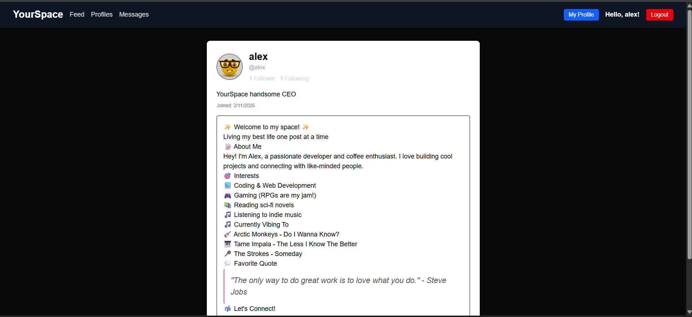
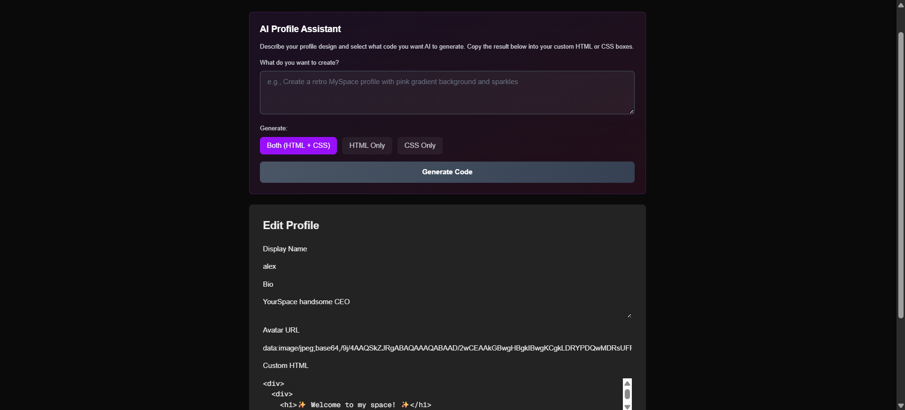
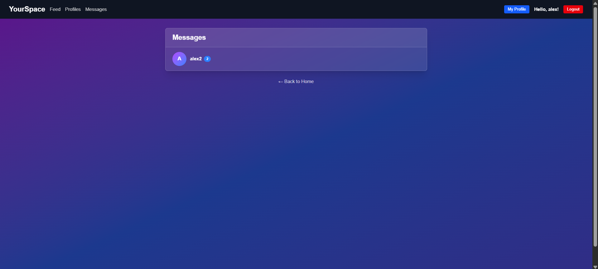
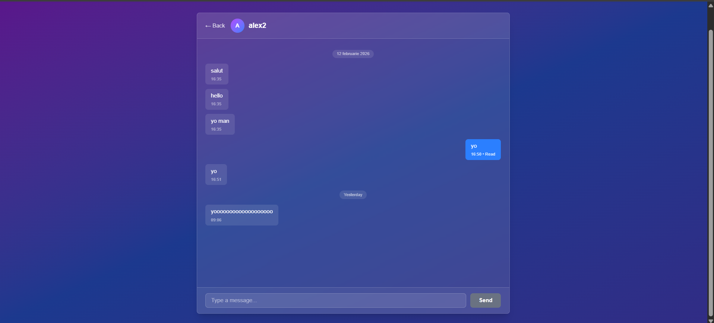
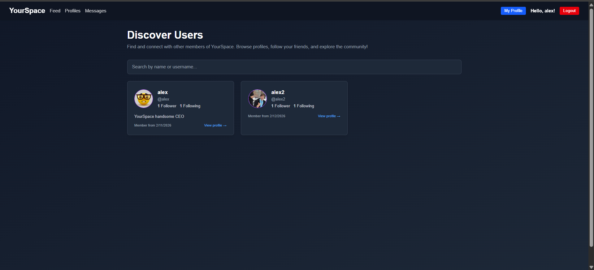
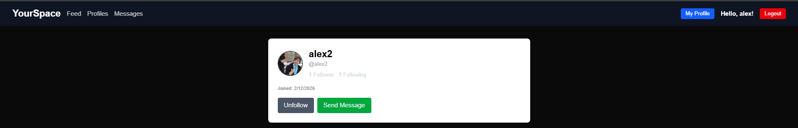

# YourSpace - Real-Time Social Platform

A modern social media platform inspired by MySpace, featuring **real-time messaging** via SignalR and fully customizable profiles.

## Implemented Features

### AI Profile Assistant (NEW!)
- **Ollama Integration** - Local AI for code generation (smollm2 360M model)
- **Natural language prompts** - "Create a retro pink profile"
- **Instant HTML/CSS generation** - Seconds to beautiful profiles
- **Safe & sanitized** - All code cleaned, no scripts/XSS
- **One-click apply** - Direct integration in profile editor

### Authentication & Security
- JWT authentication with BCrypt password hashing
- Token-based auth (localStorage + cookie support)
- Protected routes with automatic redirect
- ClaimTypes mapping for .NET compatibility

### Real-Time Messaging (SignalR)
- **Instant message delivery** - WebSocket instead of polling
- **SignalR Hub** - persistent and scalable connections
- **Typing indicators** - support for "user is typing..."
- **Auto-reconnect** - stable and resilient connection
- 1-on-1 conversations with message history
- Message grouping by date
- Clickable username → profile navigation

### User Discovery & Social Features
- Search & browse all users (`/profiles`)
- Public profile viewing (`/profile/[userId]`)
- User cards with avatar and display name
- **Follow/Unfollow System** ⭐
  - Follow button on user profiles
  - Real-time follow/unfollow toggle
  - Follow statistics (followers & following counts)
  - Follower and following list pages
- **Posts & Feed** ⭐ NEW
  - Create posts with text and optional media URL
  - Personalized feed (`/feed`) with followed users' posts first
  - "(Following)" indicator next to followed users
  - Delete own posts with authorization
  - Pagination support (load more)
  - No cloud storage - external media links only

### Architecture
- **Clean Architecture** - Controllers → Services → Repositories
- **TDD Approach** - 110+ unit tests passing
- **Dependency Injection** - all dependencies injectable
- **DTOs** for separation of concerns

## Screenshots

### Landing Page


### Authentication
**Login Page**


**Register Page**


### Feed & Posts
**Feed Page with Posts(Followed users appear first)**


### User Profiles
**Custom Profile with HTML/CSS**


### AI Profile Assistant
**Edit Profile with AI Code Generator Interface**


### Real-Time Messaging
**Conversations List**


**Chat Interface**


### Social Features
**User Discovery / Profiles List**


**Follow Button & Stats**


## Technologies

### Backend
- **.NET 10** + ASP.NET Core
- **SignalR** for real-time WebSocket communication
- **Entity Framework Core 10** with PostgreSQL
- **JWT Authentication** with custom claim mapping
- **Ollama** for AI code generation (local, free, privacy-first)
- **xUnit + Moq** for testing (110+ tests)

### Frontend
- **Next.js 16** (App Router) + React 19
- **TypeScript** strict mode
- **SignalR Client** (@microsoft/signalr) for WebSocket
- **Tailwind CSS** for styling
- Custom hooks for SignalR management

### Database
- **PostgreSQL** (via Npgsql)
- 5 tables: Users, UserProfiles, Posts (with MediaUrl), Messages, Follows
- EF Core migrations with cascade delete

## Project Structure

```
YourSpace/
├── backend/
│   ├── YourSpace.ApiService/       # REST API + SignalR Hub
│   │   ├── Controllers/            # UsersController, MessagesController, AuthController
│   │   ├── Services/               # Business logic layer
│   │   ├── Hubs/                   # ChatHub pentru SignalR
│   │   └── DTOs/                   # Data transfer objects
│   ├── YourSpace.Data/             # EF Core + Models
│   │   ├── Models/                 # User, Message, Post, UserProfile
│   │   ├── Repositories/           # Data access layer
│   │   └── Migrations/             # Database migrations
│   └── YourSpace.ApiService.Tests/ # xUnit tests (81 tests)
└── frontend/
    ├── app/                        # Next.js pages
    │   ├── messages/               # Messaging UI
    │   ├── profiles/               # User discovery
    │   └── auth/                   # Login/Register
    ├── components/                 # React components
    ├── hooks/                      # useChatHub (SignalR)
    ├── context/                    # AuthContext
    └── config/                     # API endpoints config
```

## How to Run the Project

### Prerequisites
- .NET 10 SDK
- Node.js 18+
- PostgreSQL database
- npm or yarn

### 1. Database Setup
```bash
# Ensure PostgreSQL is running
# Connection string in backend/YourSpace.ApiService/appsettings.Development.json

cd backend
dotnet ef database update --project YourSpace.Data
```

### 2. Backend
```bash
cd backend/YourSpace.ApiService
dotnet run --urls "http://localhost:5000"

# API available at: http://localhost:5000
# SignalR Hub at: http://localhost:5000/hubs/chat
# Health check: http://localhost:5000/api/health
```

### 3. Frontend
```bash
cd frontend
npm install
npm run dev

# App available at: http://localhost:3000
```

### 4. Testing
```bash
cd backend
dotnet test

# Output: 81/81 tests passing
```

## API Endpoints

### Authentication
- `POST /api/auth/register` - Create new account
- `POST /api/auth/login` - Login and receive JWT token

### Users
- `GET /api/users` - User list (JWT protected)
- `GET /api/users/{id}` - User details with profile

### Messages
- `POST /api/messages` - Send message (notify via SignalR)
- `GET /api/messages/conversations` - List conversations
- `GET /api/messages/{otherUserId}` - Messages with a user

### Follows (NEW)
- `POST /api/follows/{userId}` - Follow a user (JWT protected)
- `DELETE /api/follows/{userId}` - Unfollow a user (JWT protected)
- `GET /api/follows/is-following?followerId={id}&followedId={id}` - Check follow status
- `GET /api/follows/stats/{userId}` - Get follower/following counts

### AI Assistant
- `POST /api/ai/generate-profile-code` - Generate HTML/CSS with Ollama (JWT protected)
- `GET /api/ai/status` - Health check for AI service

### SignalR Hub
- `WS /hubs/chat` - WebSocket for real-time messaging
  - `ReceiveMessage` - Event for received messages
  - `UserTyping` - Event for typing indicator
  - `SendTypingIndicator` - Method for typing notification

## Real-Time Architecture

### Message Flow
```
User A                Backend              User B
  |                      |                    |
  |-- POST /messages --->|                    |
  |                      |-- Save to DB       |
  |<--- 200 OK ----------|                    |
  |                      |                    |
  |                      |-- SignalR -------->|
  |                      |   "ReceiveMessage" |
  |                      |                    |<-- Instant update!
```

### SignalR Benefits vs Polling
- **Latency**: 0ms vs 5000ms (polling interval)
- **Bandwidth**: Minimal (only when needed) vs constant requests
- **Scalability**: Handles thousands of connections efficiently
- **User Experience**: Instant updates, no delays

## Configuration

### Backend JWT Settings
```json
{
  "Jwt": {
    "Secret": "dev_secret_very_long_and_random_change_in_prod",
    "Issuer": "YourSpace",
    "Audience": "YourSpaceAudience",
    "ExpiryMinutes": 120
  }
}
```

### Ollama Configuration
For AI code generation:
```bash
# Install Ollama
ollama pull smollm2

# Ensure Ollama is running
ollama serve
```

**Free & Privacy-First**: Run AI locally, no API keys needed!

**Important**: 
- AI Assistant requires Ollama to be running
- Model will auto-download on first use
- Requires ~200MB disk space for smollm2 model

### Frontend SignalR Connection
```typescript
// hooks/useChatHub.ts
const connection = new HubConnectionBuilder()
  .withUrl('http://localhost:5000/hubs/chat', {
    accessTokenFactory: () => localStorage.getItem('token')
  })
  .withAutomaticReconnect()
  .build();
```

## Engineering Standards

### Test-Driven Development (TDD)
- **Mandatory**: All new features start with failing tests
- **Coverage**: 110+ tests passing (backend + frontend)
- **Tools**: xUnit + Moq for backend, Jest + React Testing Library for frontend

### Clean Architecture
- **Domain Layer**: Models without dependencies
- **Application Layer**: Services with business logic
- **Infrastructure Layer**: Repositories, EF Core
- **Presentation Layer**: Controllers with minimal logic

### Code Quality
- TypeScript strict mode in frontend
- C# nullable reference types enabled
- Dependency Injection for all dependencies
- DTOs for separation between layers

## Roadmap

### Implemented
- [x] Authentication system (JWT + BCrypt)
- [x] User management (register, login, profile viewing)
- [x] User discovery (search, browse profiles)
- [x] Real-time messaging (SignalR WebSocket)
- [x] Message history & conversations
- [x] Follow/Unfollow system with stats
- [x] Posts & Feed with pagination
- [x] Unit testing suite (110+ tests)
- [x] Clean Architecture implementation
- [x] **AI Profile Assistant (Ollama smollm2)**

### Next Steps

#### Social Features
- [ ] Post likes functionality (UI for existing LikesCount field)
- [ ] Comments on posts
- [ ] Post editing
- [ ] User mentions (@username)
- [ ] Hashtags
- [ ] Notifications feed

#### Messaging Enhancements
- [ ] Message read receipts (IsRead in UI)
- [ ] Typing indicators in UI
- [ ] Unread message badges
- [ ] Message reactions (emoji)
- [ ] File/image attachments
- [ ] Group chats

#### AI Assistant Improvements
- [ ] Multiple model support
- [ ] Theme templates gallery
- [ ] Preview before applying
- [ ] Code history/versioning

## API Examples

### Authentication
Register:
```json
{
  "username": "ana",
  "email": "ana@email.com",
  "password": "password123"
}
```

Login:
```json
{
  "usernameOrEmail": "ana",
  "password": "password123"
}
```

Response (both):
```json
{
  "success": true,
  "message": "Account created successfully.",
  "token": "eyJhbGciOiJIUzI1NiIsInR5cCI6IkpXVCJ9...",
  "user": {
    "id": 1,
    "username": "ana",
    "email": "ana@email.com",
    "createdAt": "...",
    "displayName": "ana"
  }
}
```

JWT protected request example:
```bash
curl -H "Authorization: Bearer <token>" http://localhost:5000/api/users
```

## Getting Started

1. **Clone the repository**
2. **Set up PostgreSQL** - Ensure it's running on port 5433
3. **Apply migrations** - `cd backend && dotnet ef database update --project YourSpace.Data`
4. **Start Ollama** - `ollama serve` (for AI features)
5. **Run backend** - `cd backend/YourSpace.ApiService && dotnet run --urls "http://localhost:5000"`
6. **Run frontend** - `cd frontend && npm install && npm run dev`
7. **Visit** http://localhost:3000

## License

MIT License - See LICENSE file for details

---

Made with .NET 10, Next.js 16, SignalR, and Ollama AI
